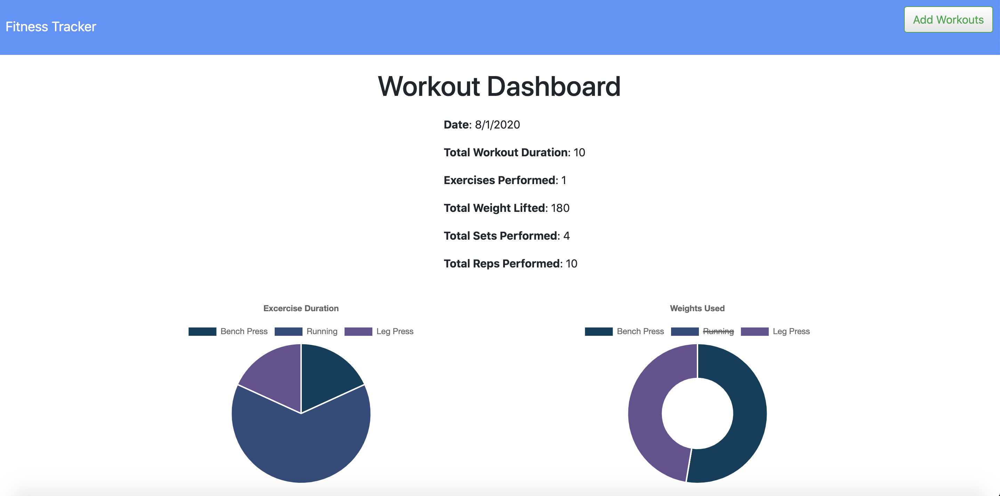

# Workout Tracker App
    

## Description
​This Node app serves as a exercise tracker where the user can input a type of exercise and the app will respond with a graphic of the cumulative exercises. This is a full-stack fitness tracker application that uses a Mongo database with a Mongoose schema and handle routes with Express. This app is also deployed on Heroku [here](https://shrouded-island-71734.herokuapp.com/).

## Table of Contents 

* [Screenshot](#screenshot)

* [Prerequisites](#prerequisites)

* [Installation](#installation)

* [Usage](#usage)

* [License](#license)

* [Contributing](#contributing)
​
* [Questions](#questions)

## Screenshot

The Workout Tracker App is live on [Heroku!](https://shrouded-island-71734.herokuapp.com/)



## Prerequisites

* [Node.js](https://nodejs.dev/)
* [MongoDB & Robo 3T](https://www.mongodb.com/download-center#community)

## Installation

You can clone the repository remotely with the following command line

```
git clone https://github.com/mmoncayo/workout-tracker.git
```

The below steps would be for if you'd like to install the app locally, and if so, you can navigate to the 'workout-tracker' directory and then follow the next steps:

To install the necessary and relevant dependencies using Node.js, run the following command:

```
npm install
```

You can then add some pre-populated data given by the seed file in the main directory of the repo by typing this command:

```
node run seed
```

There is no installation otherwise necessary if you want to connect to the app, as it is live on Heroku [here](https://shrouded-island-71734.herokuapp.com/).


## Usage

You can then run the following command and then go to your browser and enter: ```https://localhost:3000```

```
node server.js
```

Once you've accessed the app locally on your browser, you can begin navigating through the page by clicking the button to enter a new exercise on the top right corner, which will then lead you to a form to add in the specific type of exercise based on two categories: cardio and resistance (e.g., weight training). Once you enter all the values, you click 'add exercise' and you'll be prompted to the main page showing you the results of the workout you've accumulated in addition to a nice graphic displaying the same information.

## License

This project is licensed under the MIT license.

## Contributing

If you'd like to contribute to the repo, there is interest in future development in major areas for an easier UI experience, updating older workouts, etc.

If interested in contributing, please reach out via GitHub to discuss your input.

## Questions

If you have any questions about the repo, open an issue or contact [mmoncayo](https://github.com/mmoncayo) directly at matthew.moncayo@gmail.com.
